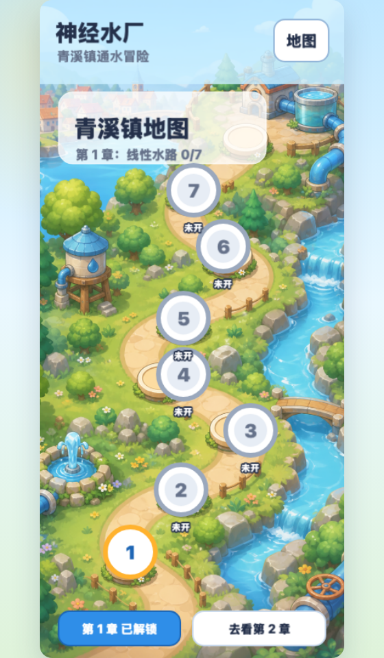

# Play Game To Learn AI

一个面向高中生和本科低年级学生的浏览器 puzzle lab：用修水管的方式学习神经网络的基础概念。



## 项目简介

《神经水厂》把神经网络里的输入、权重、偏置和输出，改写成更像游戏的水路系统：

- 水源读数：输入 `x`
- 管道粗细：权重 `w`
- 泵站水量：偏置 `b`
- 供水池水位：输出 `y`

第一章的目标是让学生在闯关中理解线性模型：

```text
y = x × w + b
```

多个水源合流时：

```text
y = x1 × w1 + x2 × w2 + b
```

通关后会解锁“水路档案”，再把游戏语言翻译成高中公式，并在最后给出大学里常见的矩阵写法：

```text
y = Xw + b
```

## 当前内容

- `Vite + Phaser 3 + RexUI` 重构版前端，不再把全部逻辑塞进单个 `index.html`。
- Phaser 单画布地图：沿着青溪镇水路逐关前进，节点按解锁进度开放。
- 第 1 章：线性水路，共 7 个关卡。
- RexUI 驱动的 HUD / 调节面板 / 通关弹层，减少手搓控件带来的错位问题。
- 固定游戏坐标系：主画面按 `390 × 844` 设计，用 `Phaser.Scale.FIT` 适配手机和桌面窗口。
- 通关总结：第 1 章完成后显示公式总结页。
- 第 2 章预告：闸门系统，计划引入激活函数，再逐步过渡到 softmax 分流。

## 本地运行

先安装依赖：

```bash
npm install
```

启动开发服务器：

```bash
npm run dev
```

默认地址：

```text
http://127.0.0.1:5173/
```

构建生产包：

```bash
npm run build
```

## 调试入口

直接进关卡：

```text
http://127.0.0.1:5173/?play=1&level=7
```

直接看地图：

```text
http://127.0.0.1:5173/?map=1
```

## 后续计划

- 第 2 章：ReLU、限流、sigmoid 等激活函数。
- 第 3 章：多个输出池的分流，引入 softmax 和分类直觉。
- 加入课程伴随模式：教师可指定关卡，学生可保存进度。
- 继续统一地图和关卡里的美术层级，让 puzzle lab 更像一款轻量游戏。
